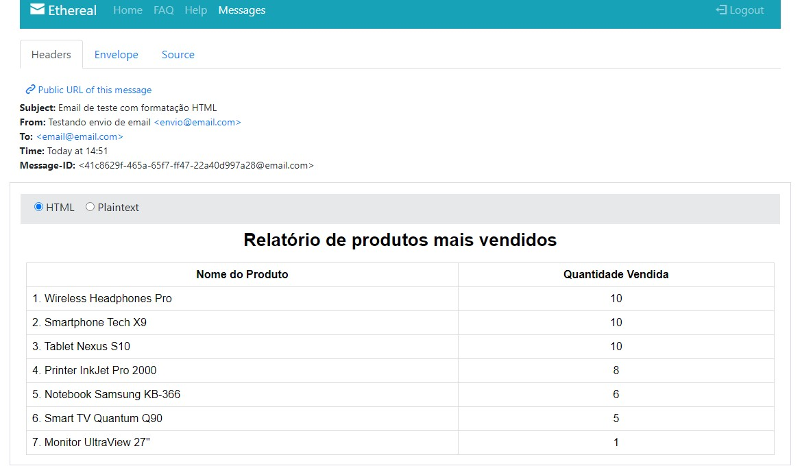

# MK CODE CHALLENGE - Candidato à vaga de Dev Back End

> Desenvolver um conjunto de APIs para um sistema de vendas de uma loja.

 

<h1 align="center">
    
</h1>

  <a href="#-sobre-o-projeto">Sobre o projeto</a>&nbsp;&nbsp;&nbsp;|&nbsp;&nbsp;&nbsp;
  <a href="#-tecnologias">Tecnologias</a>&nbsp;&nbsp;&nbsp;|&nbsp;&nbsp;&nbsp;
  <a href="#-rodando-o-projeto">Rodando o projeto</a>&nbsp;&nbsp;&nbsp;|&nbsp;&nbsp;&nbsp;
  <a href="#-como-contribuir">Como contribuir</a>&nbsp;&nbsp;&nbsp;&nbsp;&nbsp;&nbsp;

 

## 👨🏻‍💻 Sobre O projeto

Desenvolver um conjunto de APIs para um sistema de vendas de uma loja. Não há
restrição quanto ao número de funcionalidades, porém, espera-se que os componentes
abaixo sejam implementados...

**API de Criação de Usuários:**

- Endpoints para criar novos usuários.
- Funcionalidades de autenticação, como login e obtenção de tokens de acesso após a autenticação bem-sucedida.
- Implementação de autorização, definindo os tipos de permissões ou funções associadas a cada usuário (vendedor, comprador, administrador, etc.).
- Essa API também pode ser responsável por retornar informações sobre o usuário logado.

**API de Gerenciamento de Produtos:**

- Endpoints para criar, atualizar, recuperar e excluir produtos.
- Essa API permitirá que você realize operações relacionadas aos produtos, como adicionar novos produtos, atualizar seus detalhes, listar produtos disponíveis e excluir produtos.
- Exemplos de endpoints:
  - `POST /api/produtos`: Cria um novo produto.
  - `PUT /api/produtos/:id`: Atualiza os detalhes de um produto existente.
  - `GET /api/produtos`: Lista todos os produtos disponíveis.
  - `DELETE /api/produtos/:id`: Exclui um produto.
- Conecta-se à API de Criação de Usuários para verificar a autenticação e autorização do usuário antes de processar solicitações.

**API de Gerenciamento de Vendas:**

- Endpoints para criar vendas, adicionar itens a uma venda, recuperar informações de vendas e seus itens.
- Essa API permitirá que você realize operações relacionadas às vendas, como criar novas vendas, adicionar produtos a uma venda específica e recuperar informações sobre as vendas.
- Exemplos de endpoints:
  - `POST /api/vendas`: Cria uma nova venda.
  - `POST /api/vendas/:id/itens`: Adiciona um item a uma venda existente.
  - `GET /api/vendas/:id`: Retorna informações sobre uma venda específica.
  - `GET /api/vendas/:id/itens`: Retorna os itens associados a uma venda específica.
  - Implementa funcionalidades relacionadas a vendas, conforme discutido anteriormente.
  - Também se conecta à API de Criação de Usuários para verificar a autenticação e autorização do usuário antes de processar solicitações.

**Implantação com Docker e Docker Compose:**

- Docker: Utilizamos contêineres Docker para encapsular nossa aplicação.
- Docker Compose: Para orquestrar a execução de vários contêineres.

**Automatizar fluxo de envio de relatório por email com Redis:**

- Enviar emails automaticamente com BullMQ no Redis.

## 🚀 Tecnologias:

Esse projeto foi desenvolvido com as seguintes tecnologias:

- [TypeScript](https://www.typescriptlang.org/)
- [Express](https://expressjs.com/)
- [NestJS](https://nestjs.com/)
- [Prisma](https://www.prisma.io/)
- [JSON Web Token](https://jwt.io/)
- [PostgreSQL](https://www.postgresql.org/)
- [Redis](https://jestjs.io/)
- [Docker e Docker-compose](https://docs.docker.com/)

## 💻 Rodando o projeto:

1 - Clone o projeto e o abra utilizando seu editor preferido.

2 - Rode `npm install` na pasta do projeto para instalar dependências.

3 - Copiar e configurar o arquivo .env `cp .env.model .env`.

4 - Rode um `docker-compose up -d` para rodar o projeto.

5 - Rode as migrations com `npx prisma generate`.

6 - Rode `npx prisma db push` e `npx prisma migrate reset` para dar um seed no database.

7 - Você vai precisar logar o usuário para acessar as rotas com um Token: `"email: 'vendedor@email.com', password: 'saller',"`, se você instalar a extensão Thunder Client no VSCode os endpoints vão estar configurados.

## 👨‍🏫 Como contribuir:

- Faça um fork do projeto;
- Crie uma nova branch, exemplo: `git checkout -b my-feature`;
- Commit as modificações, exemplo: `git commit -m 'feat: My new feature'`;
- Faça um push para a sua branch: `git push origin my-feature`;

Desenvolvido por 🧗‍♂️&nbsp; Manfrinne Ferreira 🔥 [Contato](https://www.linkedin.com/in/manfrinne-ferreira-6033121a7/) - Code Challenge Mk Solutions 🔥
